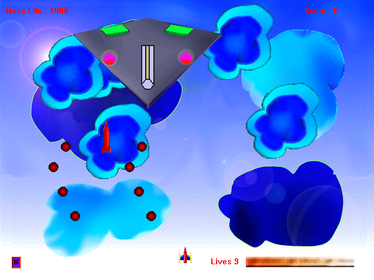

# Direct-War

I created this game in 2004 as my very first game project for fun. It is a simple 2D game written in Visual Basic 6 using DirectX 7.0 API. DirectX parts are created as modules as the game used sound, music, drawing and input functions from DirectX. This project can be used for learning the basics of game programming hehe.

My computer was at that time hehe:
Pentium 233 Mhz
32 MB RAM
4 MB VGA
Windows 98

I have recently tested it again in recent Linux distributions and it works fine using the WINE project:

You can run the game using Dwar.exe but you need DirectX 7 for Visual Basic along with few other library files as follows:

MSVBVM60.DLL
OLEAUT32.DLL
Olepro32.dll
ASYCFILT.DLL
STDOLE2.TLB
COMCAT.DLL
dx7vb.dll

To play control the plane with KeyBoard buttons

-A Fire
-S Bomb

Cheers!

Md Imam Hossain (emamhd@gmail.com)
